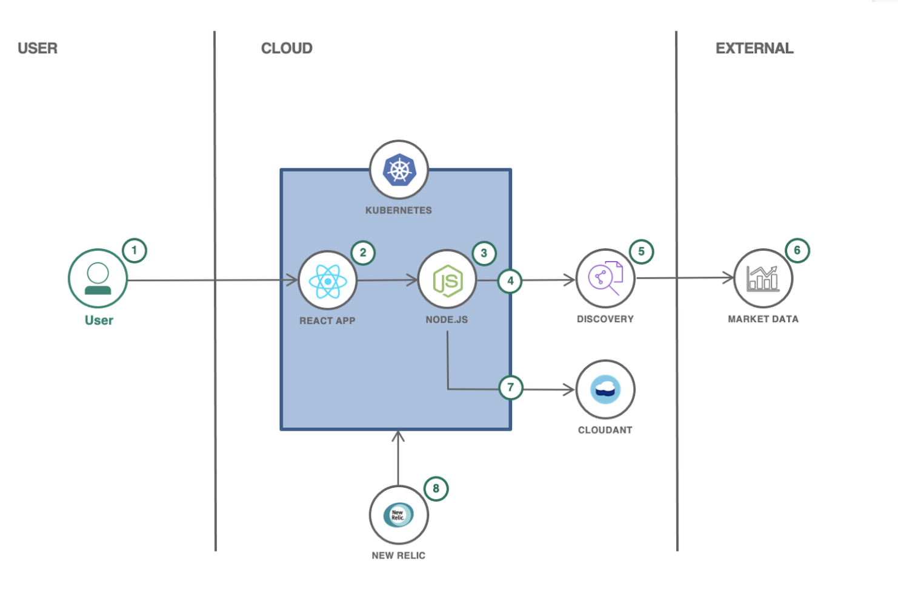

# Responsible Production and Consumption

  

Worldwide economic production and consumption rest on the use of the natural environment and resources in a way that continues to have destructive impacts on the planet. Economic and social progress over the last century has been accompanied by environmental degradation that is endangering the very systems on which our future development depends. The United Nations has established Sustainable Development Goal 12 to help ensure the world moves towards sustainable consumption and production patterns. This goal is about systemic change, decoupling economic growth from environmental degradation and applying a lifecycle thinking approach, taking into account all phases of resource use to do more and better with less. It is also about increasing resource efficiency and promoting sustainable lifestyles. It can also contribute substantially to poverty alleviation and the transition towards low-carbon and green economies. Production and consumption of goods and services should drive economic growth and improve quality of life, but with fewer natural resources and less environmental impact across the life cycle.

## Contents

1. [Short description](#short-description)
1. [Demo video](#demo-video)
1. [The architecture](#the-architecture)
1. [Getting started](#getting-started)
1. [Contributing](#contributing)
1. [Versioning](#versioning)
1. [Authors](#contributors)
1. [License](#license)
1. [Acknowledgments](#acknowledgments)

## Short description

This starter kit can help you begin your Call for Code solution. The starter kit pulls together resources to help you and your team use technology to create applications to tackle clean water and sanitation issues around the world.

### What's the problem?

The United Nations has established [Sustainable Development Goal 12](https://sdgs.un.org/goals/goal12) to help ensure the world moves towards sustainable consumption and production patterns. This goal is about systemic change, decoupling economic growth from environmental degradation and applying a lifecycle thinking approach, taking into account all phases of resource use to do more and better with less. It is also about increasing resource efficiency and promoting sustainable lifestyles. It can also contribute substantially to poverty alleviation and the transition towards low-carbon and green economies. Production and consumption of goods and services should drive economic growth and improve quality of life, but with fewer natural resources and less environmental impact across the life cycle. 

### How can technology help?

Technology can help in many ways, from recommendations on energy efficiency to highlighting the carbon footprint of online purchases. 

For example, the [Plastic Bank](https://plasticbank.com/) leverages blockchain and [IBM Cloud](https://www.ibm.com/cloud) technologies to create an application that helps monetize ocean plastic. The problem of plastic pollution in the world’s oceans has gained increasing visibility of late. Although rising awareness is a positive, it’s done little to curb the root of the problem, the estimated eight million metric tons of plastics that go into the oceans every year. Plastic Bank has the vision to set up recycling systems in economically disadvantaged parts of the world that would enable local citizens to monetize plastic pollution. Plastic Bank developed a security-rich, scalable reward system—a blockchain banking platform—that runs on IBM Cloud. 

### The idea

Recycling and recovery is one of the more pressing challenges in addressing waste and shifting to a more circular economy is the increasing complexity of products. 
For example, electronics are getting smaller and more sophisticated, making recovery and reuse of materials more challenging. Product designers must consider how to create products with end of life in mind (for example, fewer components), and we need to develop the infrastructure, policies, and systems to support repair, reuse, and recycling. 

In order to do that, we could,

Enable producers and consumers to build and buy products in a sustainable way for our society:
- By reducing waste and increasing the use of recycled materials
- By improving overall repairability of products

this can be achieved by,

- Creating a transparent and trustworthy platform for trading resources and knowledge, with access to a community of experts.
- Enabling producers and consumers to build and buy products in a sustainable way for our society:
  - By reducing waste and increasing the use of recycled materials
  - By improving overall repairability of products

To support sustainable production with recycled materials, there are two parties involved,

**A producer or a manufacturer**, who can find and compare price, quality and carbon impact of recycled materials while learning about best practices for recyclable processing through a trustworthy, real-time trading platform.

**A Recycled material Supplier** who can sell recycled resources directly to producers through a marketplace at competitive rates.

### More Solution Ideas

This section gives you an overview and various example ideas that can get you started on your path to building your solution. Please note that these ideas are examples only and your solutions are *not limited* to just these. Feel free to brainstrorm and ideate with your teams about the path you can take for *your* solution to be unique.

#Idea 1

Responsible consumption through repairability

|Who|What|How|
|--|--|--|
| A buyer of a product | can make a more informed decision based on how repairable, reusable and upgradable their potential purchase is| at a glance through an industry-standard score, measuring energy and product waste |
| A producer | can establish a more environment friendly brand | by sharing transparent information about the production process and overall repairability

#Idea 2

Extended product lifetime through repairability

|Who|What|How|
|--|--|--|
| A consumer | can find product parts, knowledge and connect with experts to repair their goods | by finding information on a platform that connects repair experts with consumers |
| A repair shop | can offer expertise and services to repair goods | via a safe marketplace to communicate with consumers |

#Idea 3
Improve waste collecting and recycling

|Who|What|How|
|--|--|--|
| A waste recycler | can learn from others about more efficient processes to process waste | by sharing information and best practices |
| A waste collector | can learn how to better collect and segregate waste | by communicating with waste recycler |

## The architecture

1. **User** interacts with a **web application** for the marketplace.
2. **React** app with communication to back end APIs.
3. **Fastify** back end handles data requested by the web app and exposes some public endpoints for material market data through a **RESTful** API.
4. Back end queries **Watson Discovery** for updated information on materials.
5. Watson Discovery manages a collection of recycled and non-recycled material information, such as average prices, carbon impact and quality. Discovery enriches the data with **Natural Language Processing** so it can be more easily indexed.
6. Public websites are **crawled** by Watson Discovery for updates on current material information.
7. Back end stores and retrieves information on material provided by users in a **Cloudant** NoSQL database.
8. A **Kubernetes** cluster is used for a scalable, flexible, modern containerized environment.
9. **New Relic** provides **full stack observability** and monitoring within the Kubernetes environment.

## Getting started

You can create a solution based on the proposed solution architecture above by exploring the following resources on the [IBM Developer](https://developer.ibm.com/) site.

### Resources

#### Watson Discovery

Extract and enrich data with a powerful analytics engine, optimizing searches with the use of Natural Language Processing.

- [Create a cognitive news search app](https://developer.ibm.com/patterns/create-a-cognitive-news-search-app/)
- [Create an app to perform intelligent searches on data](https://developer.ibm.com/patterns/create-an-app-to-perform-intelligent-searches-on-data/)

#### Kubernetes

Deploy your web applications in a highly scalable, flexible modern containerized environment.

- [Deploy a React app on Kubernetes](https://developer.ibm.com/components/react/patterns/build-an-e-learning-portal-with-watson-media/)

#### New Relic

Get observability for your Kubernetes environment and your microservies.

- [Register for a free New Relic account](https://newrelic.com/signup?utm_campaign=fy21-q4-dev_eco-all-ptnr-event-none-nr_org&utm_medium=event&utm_source=ptnr&utm_content=nr_org&fiscal_year=fy21&quarter=q4&program=dev_eco&ad_type=none&geo=all)
- [Log in to your New Relic account](https://one.newrelic.com/) and follow the guided install for Kubernetes
- [Learn how to use the Kubernetes Cluster Explorer](https://www.youtube.com/watch?v=RKaEt26HjhI&ab_channel=NewRelic)
- [Upgrade to an Observability for Good account](https://newrelic.org/signup)

#### Cloudant

A NoSQL JSON document database based on Apache CouchDB, with a free trial on IBM Cloud

- [Connecting Cloudant DBaaS to a Node.js app](https://developer.ibm.com/tutorials/learn-nodejs-node-with-cloudant-dbaas/)

#### Web scraping

Analyze available market data to make automated decisions.

- [Build an optimal product price recommendation system](https://developer.ibm.com/patterns/analyze-e-commerce-websites-and-recommend-optimal-product-pricing/)

#### Fastify

Power the back-end API with a fast and low overhead web framework for Node.js.

- [Creating a Fastify application](https://www.fastify.io/docs/latest/Getting-Started/)

#### Data sets

These public data sets provide information on the problem.

- [Link 1](https://developer.ibm.com/callforcode/technical-library/)
- [Link 2](https://developer.ibm.com/callforcode/technical-library/)
- [Link 3](https://developer.ibm.com/callforcode/technical-library/)

#### NGO documents

These are the go-to documents for measuring impact and progress against the key issue.

- [Link 1](https://developer.ibm.com/callforcode/technical-library/)
- [Link 2](https://developer.ibm.com/callforcode/technical-library/)
- [Link 3](https://developer.ibm.com/callforcode/technical-library/)

## Contributing

Please read [CONTRIBUTING.md](CONTRIBUTING.md) for details on our code of conduct, and the process for submitting pull requests.

## Contributors

- Conor O'Neill
- Daniel Rodrigues
- DebjaniChatterjee
- Dipali Chatterjee
- Georges-Henri Moll
- Nicole Pitter Patterson

See also the list of [contributors](https://github.com/Call-for-Code/Starter-Kit-Template-2021/graphs/contributors) who participated in the creation of this starter kit.

## License

This starter kit is licensed under the Apache 2 License - see the [LICENSE](LICENSE) file for details

## Acknowledgments

- Based on [Billie Thompson's README template](https://gist.github.com/PurpleBooth/109311bb0361f32d87a2).
