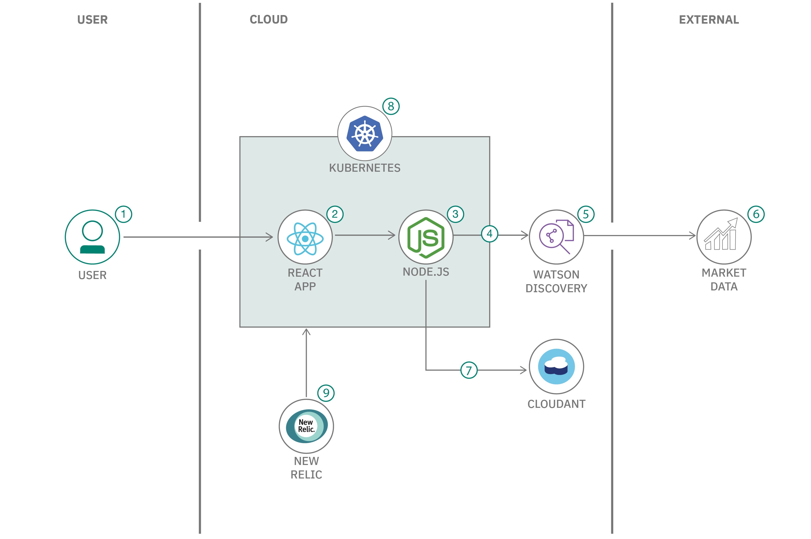

# Call for Code solution starter kit: Responsible production and green consumption

  

Worldwide economic production and consumption rest on the use of the natural environment and resources in a way that continues to have destructive impacts on the planet. Economic and social progress over the last century has been accompanied by environmental degradation that is endangering the very systems on which our future development depends. The United Nations has established Sustainable Development Goal 12 to help ensure that the world moves towards sustainable consumption and production patterns. This goal is about systemic change, decoupling economic growth from environmental degradation, and applying a lifecycle thinking approach, taking into account all phases of resource use to do more and better with less. It is also about increasing resource efficiency and promoting sustainable lifestyles. It can contribute substantially to poverty alleviation and the transition towards low-carbon and green economies. Production and consumption of goods and services should drive economic growth and improve quality of life, but with fewer natural resources and less environmental impact across the lifecycle.

## Contents

1. [Short description](#short-description)
1. [Demo video](#demo-video)
1. [The architecture](#the-architecture)
1. [Getting started](#getting-started)
1. [Contributing](#contributing)
1. [Authors](#contributors)
1. [License](#license)

## Short description

This starter kit can help you begin your Call for Code solution. The starter kit pulls together resources to help you and your team use technology to create applications to tackle clean responsible production and green consumption.

### What's the problem?

The United Nations has established [Sustainable Development Goal 12](https://sdgs.un.org/goals/goal12) to help ensure that the world moves towards sustainable consumption and production patterns. This goal is about systemic change, decoupling economic growth from environmental degradation, and applying a lifecycle thinking approach, taking into account all phases of resource use to do more and better with less. It is about increasing resource efficiency and promoting sustainable lifestyles. It can contribute substantially to poverty alleviation and the transition towards low-carbon and green economies. Production and green consumption of goods and services should drive economic growth and improve quality of life, but with fewer natural resources and less environmental impact across the lifecycle. 

### How can technology help?

Technology can help in many ways, from recommendations on energy efficiency to highlighting the carbon footprint of online purchases. 

For example, the [Plastic Bank](https://plasticbank.com/) uses blockchain and [IBM Cloud](https://www.ibm.com/cloud) technologies to create an application that helps monetize ocean plastic. The problem of plastic pollution in the world's oceans has gained increasing visibility. Although raising awareness is a positive step, it's done little to curb the root of the problem, the estimated eight million metric tons of plastics that go into the oceans every year. Plastic Bank has the vision to set up recycling systems in economically disadvantaged parts of the world that would enable local citizens to monetize plastic pollution. Plastic Bank developed a security-rich, scalable reward system — a blockchain banking platform—that runs on IBM Cloud. 

### The idea

Recycling and recovery is one of the more pressing challenges in addressing waste and shifting to a more circular economy. The increasing complexity of products plays a large role in this. For example, electronics are getting smaller and more sophisticated, making recovery and reuse of materials more challenging. Product designers must consider how to create products with end-of-life in mind (for example, fewer components), and we need to develop the infrastructure, policies, and systems to support repair, reuse, and recycling. 

To develop these policies, we could enable producers and consumers to build and buy products in a sustainable way for our society, such as:

* By reducing waste and increasing the use of recycled materials
* By improving overall repairability of products

We can achieve this by creating a transparent and trustworthy platform for trading resources and knowledge, with access to a community of experts.

To support sustainable production with recycled materials, there are two parties involved:

* **A producer or a manufacturer** who can find and compare price, quality, and carbon impact of recycled materials while learning about best practices for recyclable processing through a trustworthy, real-time trading platform

* **A recycled material supplier** who can sell recycled resources directly to producers through a marketplace at competitive rates

### More solution ideas

This section provides several examples that you and your team can use to jump-start your solution ideas. The following ideas are examples only, so feel free to brainstorm with your team to create your own original ideas and solutions. For example, the 2020 Call for Code Grand Prize winner, [Agrolly](https://developer.ibm.com/blogs/agrolly/) created a solution that uses IBM Cloud Object Storage, IBM Watson Studio, IBM Watson Assistant, and The Weather Company technologies to execute climate risk assessments, which allows farmers with less resources available to them to still make more educated decisions, obtain the necessary financing, and improve their economic outcome.

#### Idea 1

Responsible consumption through repairability

| Who | What | How |
| -- | -- | -- |
| A buyer of a product | can make a more informed decision based on how repairable, reusable, and upgradable their potential purchase is | at a glance through an industry-standard score, measuring energy and product waste |
| A producer | can establish a more environment-friendly brand | by sharing transparent information about the production process and overall repairability |

#### Idea 2

Extended product lifetime through repairability

| Who | What | How |
| -- | -- | -- |
| A consumer | can find product parts and knowledge and connect with experts to repair their goods | by finding information on a platform that connects repair experts with consumers |
| A repair shop | can offer expertise and services to repair goods | through a safe marketplace to communicate with consumers |

#### Idea 3

Improve waste collecting and recycling

| Who | What | How |
| -- | -- | -- |
| A waste recycler | can learn from others about more efficient processes to process waste | by sharing information and best practices |
| A waste collector | can learn how to better collect and segregate waste | by communicating with waste recycler |

#### Idea 4

Efficient waste collection

| Who | What | How |
| -- | -- | -- |
| A product user | can publish parts or goods they want to recycle | by publishing the information on a repository, with product/part ID, address, and date |
| A waste collector | can reserve their waste to collect and organize their pick-up tour | by accessing the repository |

## Demo video

## The architecture

1. The user interacts with a web application for the marketplace.
1. The React app communicates with the back-end APIs.
1. The Fastify back end handles data requested by the web app and exposes some public endpoints for material market data through a RESTful API.
1. The back end queries Watson Discovery for updated information on materials.
1. Watson Discovery manages a collection of recycled and non-recycled material information, such as average prices, carbon impact, and quality. Discovery enriches the data with natural language processing so that it can be more easily indexed.
1. Discovery crawls public websites for updates on current material information.
1. The back end stores and retrieves information on material that is provided by users in an IBM Cloudant NoSQL database.
1. A Kubernetes cluster is used for a scalable, flexible, modern containerized environment.
1. New Relic provides full stack observability and monitoring within the Kubernetes environment.

## Getting started

You can create a solution based on the proposed solution architecture by exploring the following resources on [IBM Developer](https://developer.ibm.com/).

### Resources

We have created a [collection of references](/references.md) that you might find useful. These resources include links to metrics, standards bodies, standards, existing marketplaces, and videos. 

#### Watson Discovery

Extract and enrich data with a powerful analytics engine, optimizing searches with the use of natural language processing.

- [Watson Discovery](https://cloud.ibm.com/catalog/services/discovery)
- [Create a cognitive news search app](https://developer.ibm.com/patterns/create-a-cognitive-news-search-app/)
- [Create an app to perform intelligent searches on data](https://developer.ibm.com/patterns/create-an-app-to-perform-intelligent-searches-on-data/)

#### Kubernetes

Deploy your web applications in a highly scalable, flexible, modern containerized environment.

- [IBM Kubernetes Service](https://cloud.ibm.com/kubernetes/catalog/about)
- [Deploy a Watson Discovery application on Kubernetes](https://developer.ibm.com/tutorials/deploy-a-simple-app-on-kubernetes-that-serves-a-web-app-and-communicates-with-watson-discovery/)

#### New Relic

Get observability for your Kubernetes environment and your microservies.

- [Register for a free New Relic account](https://newrelic.com/signup?utm_source=callforcode2021)
- [Log in to your New Relic account](https://one.newrelic.com/) and follow the guided installation for Kubernetes
- [Learn how to use the Kubernetes Cluster Explorer](https://www.youtube.com/watch?v=RKaEt26HjhI&ab_channel=NewRelic)
- [Upgrade to an Observability for Good account](https://newrelic.org/signup)

#### Cloudant

A NoSQL JSON document database based on Apache CouchDB, with a free trial on IBM Cloud.

- [IBM Cloudant](https://cloud.ibm.com/catalog/services/cloudant)
- [Connecting Cloudant DBaaS to a Node.js app](https://developer.ibm.com/tutorials/learn-nodejs-node-with-cloudant-dbaas/)

#### Web scraping

Analyze available market data to make automated decisions.

- [Build an optimal product price recommendation system](https://developer.ibm.com/patterns/analyze-e-commerce-websites-and-recommend-optimal-product-pricing/)

#### Fastify

Power the back-end API with a fast and low overhead web framework for Node.js.

- [Fastify](https://www.fastify.io/)
- [Creating a Fastify application](https://www.fastify.io/docs/latest/Getting-Started/)

## Contributing

Please read about [contributing](CONTRIBUTING.md) to this repository for details on our code of conduct and the process for submitting pull requests.

## Contributors

- [Conor O'Neill](https://www.linkedin.com/in/conoroneill/)
- [Stijn Polfliet](https://www.linkedin.com/in/spolfliet/)
- [Daniel Rodrigues](https://developer.ibm.com/profiles/danitrod/)
- [Debjani Chatterjee](https://developer.ibm.com/profiles/debjani93/)
- Dipali Chatterjee
- [Georges-Henri Moll](https://developer.ibm.com/profiles/georges-henri.moll/)
- [Nicole Pitter Patterson](https://www.linkedin.com/in/nicole-pitter-patterson/?originalSubdomain=ch)

## License

This starter kit is licensed under the Apache 2 License - see the [LICENSE](LICENSE) file for details
