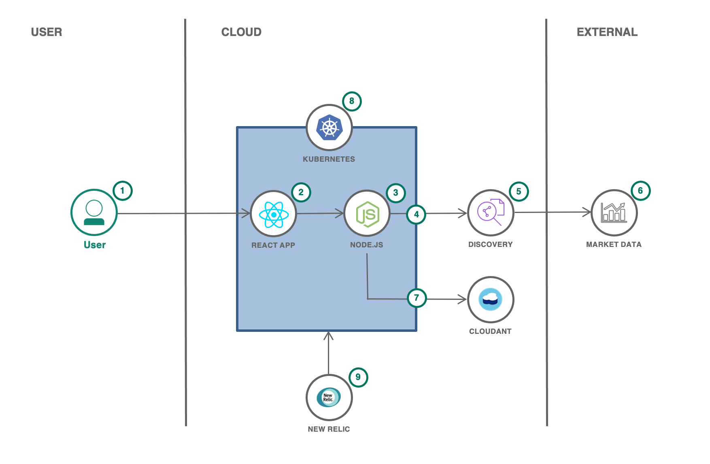

# Responsible Production and Consumption

  

Worldwide economic production and consumption rest on the use of the natural environment and resources in a way that continues to have destructive impacts on the planet. Economic and social progress over the last century has been accompaniedby environmental degradation that is endangering the very systems on which our future development depends. The United Nations has established Sustainable Development Goal 12to help ensure the world moves towards sustainable consumption and production patterns. This goal is about systemic change, decoupling economic growth from environmental degradation and applying a lifecycle thinking approach, taking into account all phases of resource use to do more and better with less. It is also about increasing resource efficiency and promoting sustainable lifestyles. It can also contribute substantially to poverty alleviation and the transition towards low-carbon and green economies. Production and consumption of goods and services should drive economic growth and improve quality of life, but with fewer natural resources and less environmental impact across the life cycle.

## Contents

1. [Short description](#short-description)
1. [Demo video](#demo-video)
1. [The architecture](#the-architecture)
1. [Getting started](#getting-started)
1. [Contributing](#contributing)
1. [Versioning](#versioning)
1. [Authors](#contributors)
1. [License](#license)
1. [Acknowledgments](#acknowledgments)

## Short description

### What's the problem?

Recycling and recovery: One of the more pressing challenges in addressing waste and shifting to a more circular economy is the increasing complexity of products. Forexample, electronics are getting smaller and more sophisticated, making recovery and reuse of materials more challenging. Product designers must consider how to create products with end of life in mind (for example, fewer components), and we need to develop the infrastructure, policies, and systems to support repair, reuse, and recycling.

### How can technology help?

Technology can help to,

- Create a transparent and trustworthy platform for trading resources and knowledge, and access to a community of experts.
- Enable producers and consumers to build and buy products in a sustainable way for our society:
  - By reducing waste and increasing the use of recycled materials
  - By improving overall repairability of products

### The idea

Support sustainable production with recycled materials. To do that, there are two parties involved,

**A producer or a manufacturer**, who can find and compare price, quality and carbon impact of recycled materials while learning about best practices for recyclable processing through a trustworthy, real-time trading platform.

**A Recycled material Supplier** who can Sell recycled resources directly to producers through a marketplace at competitive rates.

## The architecture

1. **User** interacts with a **web application** for the marketplace.
2. **React** app with communication to back end APIs.
3. **Fastify** back end handles data requested by the web app and exposes some public endpoints for material market data through a **RESTful** API.
4. Back end queries **Watson Discovery** for updated information on materials.
5. Watson Discovery manages a collection of recycled and non-recycled material information, such as average prices, carbon impact and quality. Discovery enriches the data with **Natural Language Processing** so it can be more easily indexed.
6. Public websites are **crawled** by Watson Discovery for updates on current material information.
7. Back end stores and retrieves information on material provided by users in a **Cloudant** NoSQL database.
8. A **Kubernetes** cluster is used for a scalable, flexible, modern containerized environment.
9. **New Relic** provides **full stack observability** and monitoring within the Kubernetes environment.

## Getting started

You can create a solution based on the proposed solution architecture above by exploring the following resources on the [IBM Developer](https://developer.ibm.com/) site.

### Resources

#### Artificial intelligence

Use AI to create apps that accelerate, enhance, and scale the human experience.

- [Link 1](https://developer.ibm.com/callforcode/technical-library/)
- [Link 2](https://developer.ibm.com/callforcode/technical-library/)
- [Link 3](https://developer.ibm.com/callforcode/technical-library/)

#### Data science

Analyze structured and unstructured data to extract knowledge and insights related to urgent issues.

- [Link 1](https://developer.ibm.com/callforcode/technical-library/)
- [Link 2](https://developer.ibm.com/callforcode/technical-library/)
- [Link 3](https://developer.ibm.com/callforcode/technical-library/)

#### Internet of Things

Collect and analyze device sensor data to take corrective or preventative action automatically.

- [Link 1](https://developer.ibm.com/callforcode/technical-library/)
- [Link 2](https://developer.ibm.com/callforcode/technical-library/)
- [Link 3](https://developer.ibm.com/callforcode/technical-library/)

#### Platform development

Identify the right environment, software, and runtime to power and scale your solution.

- [Link 1](https://developer.ibm.com/callforcode/technical-library/)
- [Link 2](https://developer.ibm.com/callforcode/technical-library/)
- [Link 3](https://developer.ibm.com/callforcode/technical-library/)

#### Data sets

These public data sets provide information on the problem.

- [Link 1](https://developer.ibm.com/callforcode/technical-library/)
- [Link 2](https://developer.ibm.com/callforcode/technical-library/)
- [Link 3](https://developer.ibm.com/callforcode/technical-library/)

#### NGO documents

These are the go-to documents for measuring impact and progress against the key issue.

- [Link 1](https://developer.ibm.com/callforcode/technical-library/)
- [Link 2](https://developer.ibm.com/callforcode/technical-library/)
- [Link 3](https://developer.ibm.com/callforcode/technical-library/)

## Contributing

Please read [CONTRIBUTING.md](CONTRIBUTING.md) for details on our code of conduct, and the process for submitting pull requests.

## Contributors

- Conor O'Neill
- Daniel Rodrigues
- DebjaniChatterjee
- Dipali Chatterjee
- Georges-Henri Moll
- Nicole Pitter Patterson

See also the list of [contributors](https://github.com/Call-for-Code/Starter-Kit-Template-2021/graphs/contributors) who participated in the creation of this starter kit.

## License

This starter kit is licensed under the Apache 2 License - see the [LICENSE](LICENSE) file for details

## Acknowledgments

- Based on [Billie Thompson's README template](https://gist.github.com/PurpleBooth/109311bb0361f32d87a2).
